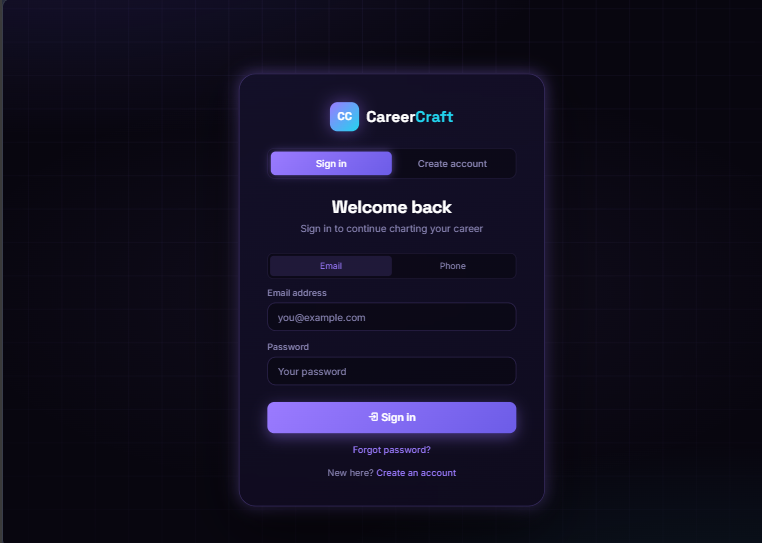
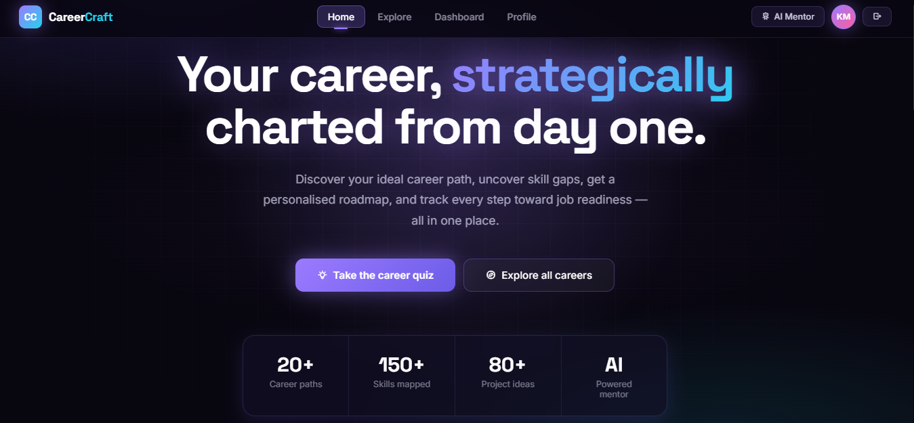
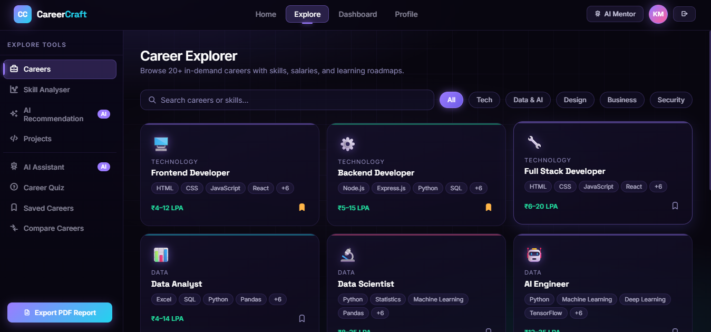
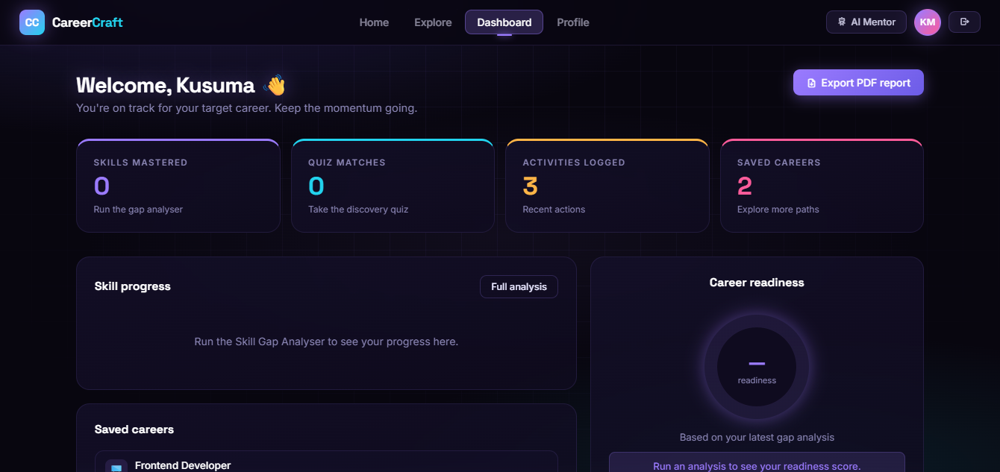
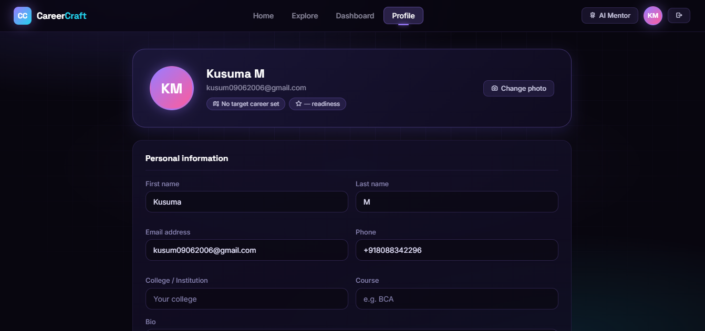

# CareerCraft-AI

**Your strategic career command center** — discover careers, analyse skill gaps, get AI-powered recommendations, and track your job readiness, all in one place.


## Overview

CareerCraft is a frontend web application built for students who feel lost about "what career should I choose?" It brings career discovery, skill-gap analysis, project recommendations, and an AI mentor into a single, focused workspace — with a dark, cosmic-themed UI.

## Features

- **Career Explorer** — Browse 20+ in-demand career paths with required skills, salaries, and learning roadmaps, filterable by category (Technology, Data & AI, Design, Business, Security).
- **Skill Gap Analyser** — Pick a target career, tick the skills you already have, and instantly see a personalised gap report.
- **AI Recommendation** — Select what describes you best and get smart, reasoned career suggestions.
- **Project Ideas** — Curated project ideas across difficulty levels (Beginner/Intermediate/Advanced) and domains (Frontend, Backend, Data & AI).
- **AI Assistant (Aria)** — A built-in chat mentor for career-related questions.
- **Career Discovery Quiz** — An 8-question quiz that matches your personality and goals to careers.
- **Saved Careers** — Bookmark careers to revisit later.
- **Compare Careers** — Side-by-side comparison of skills, salary, demand, and learning time.
- **Dashboard** — Tracks skills mastered, quiz matches, logged activities, saved careers, and an overall career readiness score.
- **Profile & Account Management** — Editable profile, career preferences, password change, notification settings, and account deletion.
- **PDF Export** — Download a personalised career readiness report as a PDF.

## Tech Stack

- **HTML5 / CSS3** — Structure and dark cosmic-themed styling
- **JavaScript (Vanilla)** — All app logic and interactivity
- **[Tabler Icons](https://tabler.io/icons)** — Icon set
- **[jsPDF](https://github.com/parallax/jsPDF)** — Client-side PDF report generation
- **Google Fonts** — Space Grotesk & Inter
- **LocalStorage** — Client-side data persistence (no backend required)

## Project Structure

```
CareerCraft/
├── index.html      # Main HTML structure (pages: Home, Explore, Dashboard, Profile)
├── styles.css       # All styling — dark purple/cosmic theme
├── app.js           # App logic (navigation, tools, quiz, AI mentor, PDF export, etc.)
└── README.md
```

## Getting Started

Since this is a fully frontend, static project with no build step, you can run it locally in seconds.

1. Clone the repository:
   ```bash
   git clone https://github.com/<your-username>/CareerCraft-AI.git
   ```
2. Navigate into the project folder:
   ```bash
   cd CareerCraft-AI
   ```
3. Open `index.html` directly in your browser, or serve it locally:
   ```bash
   npx serve .
   ```

No installation, dependencies, or backend setup required — everything runs client-side.

## 📸 Screenshots

### Login Page


### Home Page


### Explore Page


### Dashboard


### Profile Page


## Pages

| Page | Description |
|------|-------------|
| **Login** | Sign in with email/phone or create a new account |
| **Home** | Landing page with hero section, feature highlights, and testimonials |
| **Explore** | Core workspace with 8 tools (Careers, Skill Analyser, AI Recommendation, Projects, AI Assistant, Quiz, Saved, Compare) |
| **Dashboard** | Personalised stats, skill progress, readiness score, and recent activity |
| **Profile** | Personal info, career preferences, and account management |

## Design

CareerCraft uses a dark, violet/purple cosmic aesthetic inspired by RPG-style interfaces, aiming to feel less like a generic form-based tool and more like a personal strategic dashboard.

## Roadmap

- [ ] Backend integration for persistent, multi-device accounts
- [ ] Real AI API integration for the mentor and recommendations
- [ ] More career paths and expanded skill database
- [ ] Mobile app version

## Contributing

Contributions, issues, and feature requests are welcome. Feel free to open an issue or submit a pull request.

## License

This project is open source and available under the [MIT License](LICENSE).

## Author

Built by **Kusuma M** — BCA student passionate about web development and building practical, visually distinctive projects.

---

If you find this project useful, consider giving it a star on GitHub!
